# Modelo de Datos - Sistema de Restaurantes

## 1. Análisis del Dominio

El sistema de gestión de restaurantes requiere modelar las siguientes áreas funcionales:

- **Gestión de Restaurantes**: Información de establecimientos, ubicaciones y horarios
- **Catálogo de Productos**: Menús, categorías y productos con precios
- **Gestión de Usuarios**: Clientes, empleados y roles
- **Sistema de Pedidos**: Órdenes, estados y seguimiento
- **Reservaciones**: Mesas y gestión de reservas
- **Valoraciones**: Reseñas y calificaciones

---

## 2. Entidades del Sistema

### 2.1 Entidades Principales

| Entidad | Descripción | Tipo |
|---------|-------------|------|
| `restaurants` | Establecimientos gastronómicos | Principal |
| `users` | Usuarios del sistema (clientes/empleados) | Principal |
| `categories` | Categorías de productos del menú | Catálogo |
| `products` | Productos/platos del menú | Principal |
| `orders` | Pedidos realizados | Transaccional |
| `order_items` | Líneas de detalle de pedidos | Transaccional |
| `tables` | Mesas del restaurante | Principal |
| `reservations` | Reservaciones de mesas | Transaccional |
| `reviews` | Valoraciones de usuarios | Transaccional |
| `addresses` | Direcciones de entrega | Auxiliar |
| `schedules` | Horarios de operación | Auxiliar |

---

## 3. Definición de Tablas

### 3.1 Tabla `users`

Almacena la información de todos los usuarios del sistema.

```sql
CREATE TABLE users (
    id              UUID PRIMARY KEY DEFAULT gen_random_uuid(),
    email           VARCHAR(255) NOT NULL UNIQUE,
    password_hash   VARCHAR(255) NOT NULL,
    first_name      VARCHAR(100) NOT NULL,
    last_name       VARCHAR(100) NOT NULL,
    phone           VARCHAR(20),
    role            VARCHAR(20) NOT NULL DEFAULT 'customer',
    avatar_url      VARCHAR(500),
    is_active       BOOLEAN NOT NULL DEFAULT true,
    email_verified  BOOLEAN NOT NULL DEFAULT false,
    created_at      TIMESTAMP WITH TIME ZONE NOT NULL DEFAULT CURRENT_TIMESTAMP,
    updated_at      TIMESTAMP WITH TIME ZONE NOT NULL DEFAULT CURRENT_TIMESTAMP,

    CONSTRAINT chk_users_role CHECK (role IN ('customer', 'employee', 'manager', 'admin')),
    CONSTRAINT chk_users_email CHECK (email ~* '^[A-Za-z0-9._%+-]+@[A-Za-z0-9.-]+\.[A-Za-z]{2,}$')
);

CREATE INDEX idx_users_email ON users(email);
CREATE INDEX idx_users_role ON users(role);
```

### 3.2 Tabla `restaurants`

Información de los restaurantes registrados.

```sql
CREATE TABLE restaurants (
    id              UUID PRIMARY KEY DEFAULT gen_random_uuid(),
    name            VARCHAR(200) NOT NULL,
    slug            VARCHAR(200) NOT NULL UNIQUE,
    description     TEXT,
    phone           VARCHAR(20) NOT NULL,
    email           VARCHAR(255),
    logo_url        VARCHAR(500),
    cover_image_url VARCHAR(500),
    address_line    VARCHAR(300) NOT NULL,
    city            VARCHAR(100) NOT NULL,
    state           VARCHAR(100),
    postal_code     VARCHAR(20),
    country         VARCHAR(100) NOT NULL DEFAULT 'México',
    latitude        DECIMAL(10, 8),
    longitude       DECIMAL(11, 8),
    average_rating  DECIMAL(2, 1) DEFAULT 0.0,
    total_reviews   INTEGER DEFAULT 0,
    is_active       BOOLEAN NOT NULL DEFAULT true,
    owner_id        UUID NOT NULL,
    created_at      TIMESTAMP WITH TIME ZONE NOT NULL DEFAULT CURRENT_TIMESTAMP,
    updated_at      TIMESTAMP WITH TIME ZONE NOT NULL DEFAULT CURRENT_TIMESTAMP,

    CONSTRAINT fk_restaurants_owner FOREIGN KEY (owner_id)
        REFERENCES users(id) ON DELETE RESTRICT,
    CONSTRAINT chk_restaurants_rating CHECK (average_rating >= 0 AND average_rating <= 5)
);

CREATE INDEX idx_restaurants_slug ON restaurants(slug);
CREATE INDEX idx_restaurants_city ON restaurants(city);
CREATE INDEX idx_restaurants_owner ON restaurants(owner_id);
CREATE INDEX idx_restaurants_active ON restaurants(is_active) WHERE is_active = true;
```

### 3.3 Tabla `schedules`

Horarios de operación de los restaurantes.

```sql
CREATE TABLE schedules (
    id              UUID PRIMARY KEY DEFAULT gen_random_uuid(),
    restaurant_id   UUID NOT NULL,
    day_of_week     SMALLINT NOT NULL,
    open_time       TIME NOT NULL,
    close_time      TIME NOT NULL,
    is_closed       BOOLEAN NOT NULL DEFAULT false,

    CONSTRAINT fk_schedules_restaurant FOREIGN KEY (restaurant_id)
        REFERENCES restaurants(id) ON DELETE CASCADE,
    CONSTRAINT chk_schedules_day CHECK (day_of_week >= 0 AND day_of_week <= 6),
    CONSTRAINT chk_schedules_time CHECK (open_time < close_time OR is_closed = true),
    CONSTRAINT uq_schedules_restaurant_day UNIQUE (restaurant_id, day_of_week)
);

CREATE INDEX idx_schedules_restaurant ON schedules(restaurant_id);
```

### 3.4 Tabla `categories`

Categorías para organizar los productos del menú.

```sql
CREATE TABLE categories (
    id              UUID PRIMARY KEY DEFAULT gen_random_uuid(),
    restaurant_id   UUID NOT NULL,
    name            VARCHAR(100) NOT NULL,
    slug            VARCHAR(100) NOT NULL,
    description     TEXT,
    image_url       VARCHAR(500),
    display_order   INTEGER NOT NULL DEFAULT 0,
    is_active       BOOLEAN NOT NULL DEFAULT true,
    created_at      TIMESTAMP WITH TIME ZONE NOT NULL DEFAULT CURRENT_TIMESTAMP,
    updated_at      TIMESTAMP WITH TIME ZONE NOT NULL DEFAULT CURRENT_TIMESTAMP,

    CONSTRAINT fk_categories_restaurant FOREIGN KEY (restaurant_id)
        REFERENCES restaurants(id) ON DELETE CASCADE,
    CONSTRAINT uq_categories_restaurant_slug UNIQUE (restaurant_id, slug)
);

CREATE INDEX idx_categories_restaurant ON categories(restaurant_id);
CREATE INDEX idx_categories_active ON categories(is_active) WHERE is_active = true;
```

### 3.5 Tabla `products`

Productos o platos del menú.

```sql
CREATE TABLE products (
    id              UUID PRIMARY KEY DEFAULT gen_random_uuid(),
    restaurant_id   UUID NOT NULL,
    category_id     UUID NOT NULL,
    name            VARCHAR(200) NOT NULL,
    slug            VARCHAR(200) NOT NULL,
    description     TEXT,
    price           DECIMAL(10, 2) NOT NULL,
    discount_price  DECIMAL(10, 2),
    image_url       VARCHAR(500),
    preparation_time INTEGER,
    calories        INTEGER,
    is_vegetarian   BOOLEAN NOT NULL DEFAULT false,
    is_vegan        BOOLEAN NOT NULL DEFAULT false,
    is_gluten_free  BOOLEAN NOT NULL DEFAULT false,
    is_featured     BOOLEAN NOT NULL DEFAULT false,
    is_available    BOOLEAN NOT NULL DEFAULT true,
    display_order   INTEGER NOT NULL DEFAULT 0,
    created_at      TIMESTAMP WITH TIME ZONE NOT NULL DEFAULT CURRENT_TIMESTAMP,
    updated_at      TIMESTAMP WITH TIME ZONE NOT NULL DEFAULT CURRENT_TIMESTAMP,

    CONSTRAINT fk_products_restaurant FOREIGN KEY (restaurant_id)
        REFERENCES restaurants(id) ON DELETE CASCADE,
    CONSTRAINT fk_products_category FOREIGN KEY (category_id)
        REFERENCES categories(id) ON DELETE RESTRICT,
    CONSTRAINT chk_products_price CHECK (price > 0),
    CONSTRAINT chk_products_discount CHECK (discount_price IS NULL OR discount_price < price),
    CONSTRAINT uq_products_restaurant_slug UNIQUE (restaurant_id, slug)
);

CREATE INDEX idx_products_restaurant ON products(restaurant_id);
CREATE INDEX idx_products_category ON products(category_id);
CREATE INDEX idx_products_available ON products(is_available) WHERE is_available = true;
CREATE INDEX idx_products_featured ON products(is_featured) WHERE is_featured = true;
```

### 3.6 Tabla `tables`

Mesas disponibles en el restaurante.

```sql
CREATE TABLE tables (
    id              UUID PRIMARY KEY DEFAULT gen_random_uuid(),
    restaurant_id   UUID NOT NULL,
    table_number    VARCHAR(20) NOT NULL,
    capacity        SMALLINT NOT NULL,
    location        VARCHAR(50),
    is_available    BOOLEAN NOT NULL DEFAULT true,
    created_at      TIMESTAMP WITH TIME ZONE NOT NULL DEFAULT CURRENT_TIMESTAMP,
    updated_at      TIMESTAMP WITH TIME ZONE NOT NULL DEFAULT CURRENT_TIMESTAMP,

    CONSTRAINT fk_tables_restaurant FOREIGN KEY (restaurant_id)
        REFERENCES restaurants(id) ON DELETE CASCADE,
    CONSTRAINT chk_tables_capacity CHECK (capacity > 0 AND capacity <= 20),
    CONSTRAINT uq_tables_restaurant_number UNIQUE (restaurant_id, table_number)
);

CREATE INDEX idx_tables_restaurant ON tables(restaurant_id);
CREATE INDEX idx_tables_available ON tables(is_available) WHERE is_available = true;
```

### 3.7 Tabla `addresses`

Direcciones de entrega de los clientes.

```sql
CREATE TABLE addresses (
    id              UUID PRIMARY KEY DEFAULT gen_random_uuid(),
    user_id         UUID NOT NULL,
    label           VARCHAR(50) NOT NULL DEFAULT 'Casa',
    address_line    VARCHAR(300) NOT NULL,
    city            VARCHAR(100) NOT NULL,
    state           VARCHAR(100),
    postal_code     VARCHAR(20),
    country         VARCHAR(100) NOT NULL DEFAULT 'México',
    latitude        DECIMAL(10, 8),
    longitude       DECIMAL(11, 8),
    instructions    TEXT,
    is_default      BOOLEAN NOT NULL DEFAULT false,
    created_at      TIMESTAMP WITH TIME ZONE NOT NULL DEFAULT CURRENT_TIMESTAMP,
    updated_at      TIMESTAMP WITH TIME ZONE NOT NULL DEFAULT CURRENT_TIMESTAMP,

    CONSTRAINT fk_addresses_user FOREIGN KEY (user_id)
        REFERENCES users(id) ON DELETE CASCADE
);

CREATE INDEX idx_addresses_user ON addresses(user_id);
```

### 3.8 Tabla `orders`

Pedidos realizados por los clientes.

```sql
CREATE TABLE orders (
    id                  UUID PRIMARY KEY DEFAULT gen_random_uuid(),
    order_number        VARCHAR(20) NOT NULL UNIQUE,
    restaurant_id       UUID NOT NULL,
    customer_id         UUID NOT NULL,
    address_id          UUID,
    table_id            UUID,
    status              VARCHAR(30) NOT NULL DEFAULT 'pending',
    order_type          VARCHAR(20) NOT NULL,
    subtotal            DECIMAL(10, 2) NOT NULL,
    tax                 DECIMAL(10, 2) NOT NULL DEFAULT 0.00,
    delivery_fee        DECIMAL(10, 2) NOT NULL DEFAULT 0.00,
    discount            DECIMAL(10, 2) NOT NULL DEFAULT 0.00,
    total               DECIMAL(10, 2) NOT NULL,
    payment_method      VARCHAR(30),
    payment_status      VARCHAR(20) NOT NULL DEFAULT 'pending',
    notes               TEXT,
    estimated_time      INTEGER,
    confirmed_at        TIMESTAMP WITH TIME ZONE,
    prepared_at         TIMESTAMP WITH TIME ZONE,
    delivered_at        TIMESTAMP WITH TIME ZONE,
    cancelled_at        TIMESTAMP WITH TIME ZONE,
    cancellation_reason TEXT,
    created_at          TIMESTAMP WITH TIME ZONE NOT NULL DEFAULT CURRENT_TIMESTAMP,
    updated_at          TIMESTAMP WITH TIME ZONE NOT NULL DEFAULT CURRENT_TIMESTAMP,

    CONSTRAINT fk_orders_restaurant FOREIGN KEY (restaurant_id)
        REFERENCES restaurants(id) ON DELETE RESTRICT,
    CONSTRAINT fk_orders_customer FOREIGN KEY (customer_id)
        REFERENCES users(id) ON DELETE RESTRICT,
    CONSTRAINT fk_orders_address FOREIGN KEY (address_id)
        REFERENCES addresses(id) ON DELETE SET NULL,
    CONSTRAINT fk_orders_table FOREIGN KEY (table_id)
        REFERENCES tables(id) ON DELETE SET NULL,
    CONSTRAINT chk_orders_status CHECK (status IN (
        'pending', 'confirmed', 'preparing', 'ready',
        'on_the_way', 'delivered', 'completed', 'cancelled'
    )),
    CONSTRAINT chk_orders_type CHECK (order_type IN ('dine_in', 'takeout', 'delivery')),
    CONSTRAINT chk_orders_payment_status CHECK (payment_status IN ('pending', 'paid', 'refunded', 'failed')),
    CONSTRAINT chk_orders_total CHECK (total >= 0)
);

CREATE INDEX idx_orders_restaurant ON orders(restaurant_id);
CREATE INDEX idx_orders_customer ON orders(customer_id);
CREATE INDEX idx_orders_status ON orders(status);
CREATE INDEX idx_orders_created ON orders(created_at DESC);
CREATE INDEX idx_orders_number ON orders(order_number);
```

### 3.9 Tabla `order_items`

Detalle de productos en cada pedido.

```sql
CREATE TABLE order_items (
    id              UUID PRIMARY KEY DEFAULT gen_random_uuid(),
    order_id        UUID NOT NULL,
    product_id      UUID NOT NULL,
    product_name    VARCHAR(200) NOT NULL,
    quantity        SMALLINT NOT NULL,
    unit_price      DECIMAL(10, 2) NOT NULL,
    subtotal        DECIMAL(10, 2) NOT NULL,
    notes           TEXT,
    created_at      TIMESTAMP WITH TIME ZONE NOT NULL DEFAULT CURRENT_TIMESTAMP,

    CONSTRAINT fk_order_items_order FOREIGN KEY (order_id)
        REFERENCES orders(id) ON DELETE CASCADE,
    CONSTRAINT fk_order_items_product FOREIGN KEY (product_id)
        REFERENCES products(id) ON DELETE RESTRICT,
    CONSTRAINT chk_order_items_quantity CHECK (quantity > 0),
    CONSTRAINT chk_order_items_price CHECK (unit_price >= 0)
);

CREATE INDEX idx_order_items_order ON order_items(order_id);
CREATE INDEX idx_order_items_product ON order_items(product_id);
```

### 3.10 Tabla `reservations`

Reservaciones de mesas.

```sql
CREATE TABLE reservations (
    id                  UUID PRIMARY KEY DEFAULT gen_random_uuid(),
    reservation_number  VARCHAR(20) NOT NULL UNIQUE,
    restaurant_id       UUID NOT NULL,
    customer_id         UUID NOT NULL,
    table_id            UUID,
    party_size          SMALLINT NOT NULL,
    reservation_date    DATE NOT NULL,
    reservation_time    TIME NOT NULL,
    duration_minutes    INTEGER NOT NULL DEFAULT 90,
    status              VARCHAR(20) NOT NULL DEFAULT 'pending',
    notes               TEXT,
    confirmed_at        TIMESTAMP WITH TIME ZONE,
    cancelled_at        TIMESTAMP WITH TIME ZONE,
    cancellation_reason TEXT,
    created_at          TIMESTAMP WITH TIME ZONE NOT NULL DEFAULT CURRENT_TIMESTAMP,
    updated_at          TIMESTAMP WITH TIME ZONE NOT NULL DEFAULT CURRENT_TIMESTAMP,

    CONSTRAINT fk_reservations_restaurant FOREIGN KEY (restaurant_id)
        REFERENCES restaurants(id) ON DELETE RESTRICT,
    CONSTRAINT fk_reservations_customer FOREIGN KEY (customer_id)
        REFERENCES users(id) ON DELETE RESTRICT,
    CONSTRAINT fk_reservations_table FOREIGN KEY (table_id)
        REFERENCES tables(id) ON DELETE SET NULL,
    CONSTRAINT chk_reservations_party CHECK (party_size > 0 AND party_size <= 20),
    CONSTRAINT chk_reservations_status CHECK (status IN (
        'pending', 'confirmed', 'seated', 'completed', 'cancelled', 'no_show'
    ))
);

CREATE INDEX idx_reservations_restaurant ON reservations(restaurant_id);
CREATE INDEX idx_reservations_customer ON reservations(customer_id);
CREATE INDEX idx_reservations_date ON reservations(reservation_date);
CREATE INDEX idx_reservations_status ON reservations(status);
```

### 3.11 Tabla `reviews`

Valoraciones y reseñas de los clientes.

```sql
CREATE TABLE reviews (
    id              UUID PRIMARY KEY DEFAULT gen_random_uuid(),
    restaurant_id   UUID NOT NULL,
    customer_id     UUID NOT NULL,
    order_id        UUID,
    rating          SMALLINT NOT NULL,
    title           VARCHAR(200),
    comment         TEXT,
    is_verified     BOOLEAN NOT NULL DEFAULT false,
    is_visible      BOOLEAN NOT NULL DEFAULT true,
    response        TEXT,
    response_at     TIMESTAMP WITH TIME ZONE,
    created_at      TIMESTAMP WITH TIME ZONE NOT NULL DEFAULT CURRENT_TIMESTAMP,
    updated_at      TIMESTAMP WITH TIME ZONE NOT NULL DEFAULT CURRENT_TIMESTAMP,

    CONSTRAINT fk_reviews_restaurant FOREIGN KEY (restaurant_id)
        REFERENCES restaurants(id) ON DELETE CASCADE,
    CONSTRAINT fk_reviews_customer FOREIGN KEY (customer_id)
        REFERENCES users(id) ON DELETE CASCADE,
    CONSTRAINT fk_reviews_order FOREIGN KEY (order_id)
        REFERENCES orders(id) ON DELETE SET NULL,
    CONSTRAINT chk_reviews_rating CHECK (rating >= 1 AND rating <= 5),
    CONSTRAINT uq_reviews_customer_restaurant UNIQUE (customer_id, restaurant_id)
);

CREATE INDEX idx_reviews_restaurant ON reviews(restaurant_id);
CREATE INDEX idx_reviews_customer ON reviews(customer_id);
CREATE INDEX idx_reviews_rating ON reviews(rating);
```

---

## 4. Relaciones entre Entidades

### 4.1 Resumen de Relaciones

| Relación | Cardinalidad | Descripción |
|----------|--------------|-------------|
| `users` ’ `restaurants` | 1:N | Un usuario puede ser dueño de varios restaurantes |
| `users` ’ `addresses` | 1:N | Un usuario puede tener varias direcciones |
| `users` ’ `orders` | 1:N | Un usuario puede realizar varios pedidos |
| `users` ’ `reservations` | 1:N | Un usuario puede tener varias reservaciones |
| `users` ’ `reviews` | 1:N | Un usuario puede escribir varias reseñas |
| `restaurants` ’ `schedules` | 1:N | Un restaurante tiene múltiples horarios |
| `restaurants` ’ `categories` | 1:N | Un restaurante tiene varias categorías |
| `restaurants` ’ `products` | 1:N | Un restaurante tiene varios productos |
| `restaurants` ’ `tables` | 1:N | Un restaurante tiene varias mesas |
| `restaurants` ’ `orders` | 1:N | Un restaurante recibe varios pedidos |
| `restaurants` ’ `reservations` | 1:N | Un restaurante tiene varias reservaciones |
| `restaurants` ’ `reviews` | 1:N | Un restaurante tiene varias reseñas |
| `categories` ’ `products` | 1:N | Una categoría contiene varios productos |
| `orders` ’ `order_items` | 1:N | Un pedido tiene varias líneas de detalle |
| `tables` ’ `orders` | 1:N | Una mesa puede tener varios pedidos |
| `tables` ’ `reservations` | 1:N | Una mesa puede tener varias reservaciones |
| `addresses` ’ `orders` | 1:N | Una dirección puede usarse en varios pedidos |

### 4.2 Reglas de Integridad Referencial

| FK | ON DELETE | ON UPDATE | Justificación |
|----|-----------|-----------|---------------|
| `restaurants.owner_id` | RESTRICT | CASCADE | No eliminar usuarios con restaurantes |
| `schedules.restaurant_id` | CASCADE | CASCADE | Eliminar horarios si se elimina restaurante |
| `categories.restaurant_id` | CASCADE | CASCADE | Eliminar categorías si se elimina restaurante |
| `products.restaurant_id` | CASCADE | CASCADE | Eliminar productos si se elimina restaurante |
| `products.category_id` | RESTRICT | CASCADE | No eliminar categorías con productos |
| `tables.restaurant_id` | CASCADE | CASCADE | Eliminar mesas si se elimina restaurante |
| `addresses.user_id` | CASCADE | CASCADE | Eliminar direcciones si se elimina usuario |
| `orders.restaurant_id` | RESTRICT | CASCADE | No eliminar restaurantes con pedidos |
| `orders.customer_id` | RESTRICT | CASCADE | No eliminar usuarios con pedidos |
| `orders.address_id` | SET NULL | CASCADE | Mantener pedido sin dirección |
| `orders.table_id` | SET NULL | CASCADE | Mantener pedido sin mesa |
| `order_items.order_id` | CASCADE | CASCADE | Eliminar items si se elimina pedido |
| `order_items.product_id` | RESTRICT | CASCADE | No eliminar productos con pedidos |
| `reservations.restaurant_id` | RESTRICT | CASCADE | No eliminar restaurantes con reservas |
| `reservations.customer_id` | RESTRICT | CASCADE | No eliminar usuarios con reservas |
| `reservations.table_id` | SET NULL | CASCADE | Mantener reserva sin mesa asignada |
| `reviews.restaurant_id` | CASCADE | CASCADE | Eliminar reseñas si se elimina restaurante |
| `reviews.customer_id` | CASCADE | CASCADE | Eliminar reseñas si se elimina usuario |
| `reviews.order_id` | SET NULL | CASCADE | Mantener reseña sin pedido asociado |

---

## 5. Restricciones y Validaciones

### 5.1 Restricciones CHECK

```sql
-- Validación de email
CONSTRAINT chk_users_email CHECK (email ~* '^[A-Za-z0-9._%+-]+@[A-Za-z0-9.-]+\.[A-Za-z]{2,}$')

-- Rango de calificaciones
CONSTRAINT chk_restaurants_rating CHECK (average_rating >= 0 AND average_rating <= 5)
CONSTRAINT chk_reviews_rating CHECK (rating >= 1 AND rating <= 5)

-- Validación de precios
CONSTRAINT chk_products_price CHECK (price > 0)
CONSTRAINT chk_products_discount CHECK (discount_price IS NULL OR discount_price < price)
CONSTRAINT chk_orders_total CHECK (total >= 0)
CONSTRAINT chk_order_items_price CHECK (unit_price >= 0)
CONSTRAINT chk_order_items_quantity CHECK (quantity > 0)

-- Validación de capacidades
CONSTRAINT chk_tables_capacity CHECK (capacity > 0 AND capacity <= 20)
CONSTRAINT chk_reservations_party CHECK (party_size > 0 AND party_size <= 20)

-- Validación de horarios
CONSTRAINT chk_schedules_day CHECK (day_of_week >= 0 AND day_of_week <= 6)
CONSTRAINT chk_schedules_time CHECK (open_time < close_time OR is_closed = true)

-- Enumeraciones
CONSTRAINT chk_users_role CHECK (role IN ('customer', 'employee', 'manager', 'admin'))
CONSTRAINT chk_orders_status CHECK (status IN ('pending', 'confirmed', 'preparing', 'ready', 'on_the_way', 'delivered', 'completed', 'cancelled'))
CONSTRAINT chk_orders_type CHECK (order_type IN ('dine_in', 'takeout', 'delivery'))
CONSTRAINT chk_orders_payment_status CHECK (payment_status IN ('pending', 'paid', 'refunded', 'failed'))
CONSTRAINT chk_reservations_status CHECK (status IN ('pending', 'confirmed', 'seated', 'completed', 'cancelled', 'no_show'))
```

### 5.2 Restricciones UNIQUE

```sql
-- Identificadores únicos
CONSTRAINT uq_users_email UNIQUE (email)
CONSTRAINT uq_restaurants_slug UNIQUE (slug)
CONSTRAINT uq_orders_number UNIQUE (order_number)
CONSTRAINT uq_reservations_number UNIQUE (reservation_number)

-- Unicidad compuesta
CONSTRAINT uq_schedules_restaurant_day UNIQUE (restaurant_id, day_of_week)
CONSTRAINT uq_categories_restaurant_slug UNIQUE (restaurant_id, slug)
CONSTRAINT uq_products_restaurant_slug UNIQUE (restaurant_id, slug)
CONSTRAINT uq_tables_restaurant_number UNIQUE (restaurant_id, table_number)
CONSTRAINT uq_reviews_customer_restaurant UNIQUE (customer_id, restaurant_id)
```

---

## 6. Diagrama Entidad-Relación

```mermaid
erDiagram
    users {
        uuid id PK
        varchar email UK
        varchar password_hash
        varchar first_name
        varchar last_name
        varchar phone
        varchar role
        varchar avatar_url
        boolean is_active
        boolean email_verified
        timestamp created_at
        timestamp updated_at
    }

    restaurants {
        uuid id PK
        varchar name
        varchar slug UK
        text description
        varchar phone
        varchar email
        varchar logo_url
        varchar cover_image_url
        varchar address_line
        varchar city
        varchar state
        varchar postal_code
        varchar country
        decimal latitude
        decimal longitude
        decimal average_rating
        integer total_reviews
        boolean is_active
        uuid owner_id FK
        timestamp created_at
        timestamp updated_at
    }

    schedules {
        uuid id PK
        uuid restaurant_id FK
        smallint day_of_week
        time open_time
        time close_time
        boolean is_closed
    }

    categories {
        uuid id PK
        uuid restaurant_id FK
        varchar name
        varchar slug
        text description
        varchar image_url
        integer display_order
        boolean is_active
        timestamp created_at
        timestamp updated_at
    }

    products {
        uuid id PK
        uuid restaurant_id FK
        uuid category_id FK
        varchar name
        varchar slug
        text description
        decimal price
        decimal discount_price
        varchar image_url
        integer preparation_time
        integer calories
        boolean is_vegetarian
        boolean is_vegan
        boolean is_gluten_free
        boolean is_featured
        boolean is_available
        integer display_order
        timestamp created_at
        timestamp updated_at
    }

    tables {
        uuid id PK
        uuid restaurant_id FK
        varchar table_number
        smallint capacity
        varchar location
        boolean is_available
        timestamp created_at
        timestamp updated_at
    }

    addresses {
        uuid id PK
        uuid user_id FK
        varchar label
        varchar address_line
        varchar city
        varchar state
        varchar postal_code
        varchar country
        decimal latitude
        decimal longitude
        text instructions
        boolean is_default
        timestamp created_at
        timestamp updated_at
    }

    orders {
        uuid id PK
        varchar order_number UK
        uuid restaurant_id FK
        uuid customer_id FK
        uuid address_id FK
        uuid table_id FK
        varchar status
        varchar order_type
        decimal subtotal
        decimal tax
        decimal delivery_fee
        decimal discount
        decimal total
        varchar payment_method
        varchar payment_status
        text notes
        integer estimated_time
        timestamp confirmed_at
        timestamp prepared_at
        timestamp delivered_at
        timestamp cancelled_at
        text cancellation_reason
        timestamp created_at
        timestamp updated_at
    }

    order_items {
        uuid id PK
        uuid order_id FK
        uuid product_id FK
        varchar product_name
        smallint quantity
        decimal unit_price
        decimal subtotal
        text notes
        timestamp created_at
    }

    reservations {
        uuid id PK
        varchar reservation_number UK
        uuid restaurant_id FK
        uuid customer_id FK
        uuid table_id FK
        smallint party_size
        date reservation_date
        time reservation_time
        integer duration_minutes
        varchar status
        text notes
        timestamp confirmed_at
        timestamp cancelled_at
        text cancellation_reason
        timestamp created_at
        timestamp updated_at
    }

    reviews {
        uuid id PK
        uuid restaurant_id FK
        uuid customer_id FK
        uuid order_id FK
        smallint rating
        varchar title
        text comment
        boolean is_verified
        boolean is_visible
        text response
        timestamp response_at
        timestamp created_at
        timestamp updated_at
    }

    %% Relaciones
    users ||--o{ restaurants : "owns"
    users ||--o{ addresses : "has"
    users ||--o{ orders : "places"
    users ||--o{ reservations : "makes"
    users ||--o{ reviews : "writes"

    restaurants ||--o{ schedules : "has"
    restaurants ||--o{ categories : "has"
    restaurants ||--o{ products : "offers"
    restaurants ||--o{ tables : "has"
    restaurants ||--o{ orders : "receives"
    restaurants ||--o{ reservations : "accepts"
    restaurants ||--o{ reviews : "has"

    categories ||--o{ products : "contains"

    orders ||--o{ order_items : "contains"
    orders ||--o| addresses : "delivered_to"
    orders ||--o| tables : "served_at"

    products ||--o{ order_items : "ordered_as"

    tables ||--o{ reservations : "reserved_for"

    reviews ||--o| orders : "about"
```



---

## 7. Índices de Rendimiento

### 7.1 Índices Primarios (PK)

Todos los campos `id` tienen índice automático por ser PRIMARY KEY.

### 7.2 Índices de Búsqueda

```sql
-- Búsquedas frecuentes
CREATE INDEX idx_users_email ON users(email);
CREATE INDEX idx_restaurants_slug ON restaurants(slug);
CREATE INDEX idx_restaurants_city ON restaurants(city);
CREATE INDEX idx_orders_number ON orders(order_number);

-- Filtros por estado
CREATE INDEX idx_restaurants_active ON restaurants(is_active) WHERE is_active = true;
CREATE INDEX idx_products_available ON products(is_available) WHERE is_available = true;
CREATE INDEX idx_products_featured ON products(is_featured) WHERE is_featured = true;
CREATE INDEX idx_tables_available ON tables(is_available) WHERE is_available = true;

-- Ordenamiento temporal
CREATE INDEX idx_orders_created ON orders(created_at DESC);
CREATE INDEX idx_reservations_date ON reservations(reservation_date);
```

### 7.3 Índices de Foreign Keys

```sql
-- Relaciones principales
CREATE INDEX idx_restaurants_owner ON restaurants(owner_id);
CREATE INDEX idx_schedules_restaurant ON schedules(restaurant_id);
CREATE INDEX idx_categories_restaurant ON categories(restaurant_id);
CREATE INDEX idx_products_restaurant ON products(restaurant_id);
CREATE INDEX idx_products_category ON products(category_id);
CREATE INDEX idx_tables_restaurant ON tables(restaurant_id);
CREATE INDEX idx_addresses_user ON addresses(user_id);
CREATE INDEX idx_orders_restaurant ON orders(restaurant_id);
CREATE INDEX idx_orders_customer ON orders(customer_id);
CREATE INDEX idx_order_items_order ON order_items(order_id);
CREATE INDEX idx_order_items_product ON order_items(product_id);
CREATE INDEX idx_reservations_restaurant ON reservations(restaurant_id);
CREATE INDEX idx_reservations_customer ON reservations(customer_id);
CREATE INDEX idx_reviews_restaurant ON reviews(restaurant_id);
CREATE INDEX idx_reviews_customer ON reviews(customer_id);
```

---

## 8. Triggers y Funciones

### 8.1 Actualización Automática de `updated_at`

```sql
CREATE OR REPLACE FUNCTION update_updated_at_column()
RETURNS TRIGGER AS $$
BEGIN
    NEW.updated_at = CURRENT_TIMESTAMP;
    RETURN NEW;
END;
$$ LANGUAGE plpgsql;

-- Aplicar a todas las tablas con updated_at
CREATE TRIGGER trg_users_updated_at
    BEFORE UPDATE ON users
    FOR EACH ROW EXECUTE FUNCTION update_updated_at_column();

CREATE TRIGGER trg_restaurants_updated_at
    BEFORE UPDATE ON restaurants
    FOR EACH ROW EXECUTE FUNCTION update_updated_at_column();

-- ... aplicar a demás tablas con updated_at
```

### 8.2 Actualización de Rating del Restaurante

```sql
CREATE OR REPLACE FUNCTION update_restaurant_rating()
RETURNS TRIGGER AS $$
BEGIN
    UPDATE restaurants
    SET
        average_rating = (
            SELECT COALESCE(AVG(rating)::DECIMAL(2,1), 0)
            FROM reviews
            WHERE restaurant_id = COALESCE(NEW.restaurant_id, OLD.restaurant_id)
            AND is_visible = true
        ),
        total_reviews = (
            SELECT COUNT(*)
            FROM reviews
            WHERE restaurant_id = COALESCE(NEW.restaurant_id, OLD.restaurant_id)
            AND is_visible = true
        )
    WHERE id = COALESCE(NEW.restaurant_id, OLD.restaurant_id);

    RETURN COALESCE(NEW, OLD);
END;
$$ LANGUAGE plpgsql;

CREATE TRIGGER trg_reviews_rating
    AFTER INSERT OR UPDATE OR DELETE ON reviews
    FOR EACH ROW EXECUTE FUNCTION update_restaurant_rating();
```

### 8.3 Generación de Números de Pedido

```sql
CREATE OR REPLACE FUNCTION generate_order_number()
RETURNS TRIGGER AS $$
BEGIN
    NEW.order_number = 'ORD-' || TO_CHAR(CURRENT_DATE, 'YYYYMMDD') || '-' ||
                       LPAD(nextval('order_number_seq')::TEXT, 6, '0');
    RETURN NEW;
END;
$$ LANGUAGE plpgsql;

CREATE SEQUENCE order_number_seq START WITH 1;

CREATE TRIGGER trg_orders_number
    BEFORE INSERT ON orders
    FOR EACH ROW EXECUTE FUNCTION generate_order_number();
```

---

## 9. Script de Creación Completo

El script completo de creación de la base de datos se encuentra en:
`/sql/migrations/001_initial_schema.sql`

### Orden de Ejecución

1. Crear extensiones necesarias (`uuid-ossp`)
2. Crear tablas en orden de dependencias
3. Crear índices
4. Crear funciones y triggers
5. Insertar datos iniciales (seeds)

---

## 10. Consideraciones de Seguridad

### 10.1 Datos Sensibles

| Campo | Tabla | Tratamiento |
|-------|-------|-------------|
| `password_hash` | `users` | Hash bcrypt, nunca en texto plano |
| `email` | `users` | Encriptación en reposo recomendada |
| `phone` | `users`, `restaurants` | Datos personales protegidos |
| `address_line` | `addresses` | Información de ubicación sensible |

### 10.2 Row Level Security (RLS)

```sql
-- Habilitar RLS en tablas sensibles
ALTER TABLE orders ENABLE ROW LEVEL SECURITY;
ALTER TABLE addresses ENABLE ROW LEVEL SECURITY;
ALTER TABLE reviews ENABLE ROW LEVEL SECURITY;

-- Política: usuarios solo ven sus propios pedidos
CREATE POLICY orders_customer_policy ON orders
    FOR ALL
    USING (customer_id = current_user_id());
```

---

## 11. Versionado del Esquema

| Versión | Fecha | Descripción |
|---------|-------|-------------|
| 1.0.0 | 2024-XX-XX | Esquema inicial |

---

*Documento generado como parte de la arquitectura del sistema de restaurantes.*
